# 实时语音情绪识别：让电脑读懂你的情绪

## 项目背景

你是否想过，电脑可以通过你的声音识别出你的情绪状态？在当今人工智能快速发展的时代，语音情绪识别技术正逐渐走进我们的生活。无论是智能客服、心理辅导还是游戏开发，这项技术都有着广泛的应用前景。

## 项目简介

我们开发了一个实时语音情绪识别系统，能够通过麦克风录制你的语音，并实时分析其中包含的情绪。系统支持识别六种基本情绪：中性、快乐、悲伤、愤怒、恐惧和惊讶，让电脑真正"听懂"你的心情。

## 核心功能

### 实时识别
只需3秒，系统就能完成音频录制、特征提取和情绪识别的全过程，让你即时了解自己的情绪状态。

### 多种模型支持
系统集成了三种不同的机器学习模型：
- **SVM**：支持向量机，传统机器学习算法的代表
- **Random Forest**：随机森林，基于决策树的集成学习方法
- **MLP**：多层感知器，基于深度学习的神经网络模型

### 连续识别模式
开启连续识别模式后，系统会不断监测你的情绪变化，适用于需要持续情绪监测的场景。

### GPU加速
MLP模型支持GPU加速推理，大幅提高识别速度，让实时分析更加流畅。

### 直观结果展示
识别结果不仅显示主要情绪，还会展示各情绪类别的概率分布，让你对自己的情绪状态有更全面的了解。

## 技术实现

### 技术栈
- **Python**：主要开发语言
- **音频处理**：sounddevice、soundfile
- **特征提取**：自定义特征提取器（提取MFCC、能量等声学特征）
- **机器学习**：scikit-learn（SVM、Random Forest）、PyTorch（MLP）
- **数据可视化**：matplotlib

### 特征提取方法

#### 1. MFCC (Mel Frequency Cepstral Coefficients)

MFCC是语音处理中最常用的特征之一，它模拟了人耳对声音的感知特性。计算步骤如下：

1. **预加重**：对音频信号应用预加重滤波器，增强高频部分
   $$ y(t) = x(t) - 0.97x(t-1) $$

2. **分帧**：将音频信号分成重叠的帧，每帧长度为2048个采样点，帧移为512个采样点

3. **加窗**：对每帧应用汉明窗，减少频谱泄漏
   $$ w(n) = 0.54 - 0.46 \cos\left(\frac{2\pi n}{N-1}\right) $$

4. **FFT变换**：计算每帧的快速傅里叶变换，得到频谱

5. **Mel滤波器组**：将频谱通过Mel滤波器组，转换到Mel频率域
   $$ f_{mel}(f) = 2595 \log_{10}\left(1 + \frac{f}{700}\right) $$

6. **对数能量**：计算每个Mel滤波器的输出能量，并取对数

7. **DCT变换**：对对数能量应用离散余弦变换，取前40个系数作为MFCC特征

#### 2. 其他声学特征

- **过零率 (ZCR)**：衡量音频信号穿越零值的频率，反映信号的粗糙度
  $$ ZCR = \frac{1}{T-1} \sum_{t=1}^{T-1} 1\{x(t)x(t-1) < 0\} $$

- **RMS能量**：反映音频的响度，计算公式为
  $$ RMS = \sqrt{\frac{1}{T} \sum_{t=1}^{T} x(t)^2} $$

- **色度特征 (Chroma)**：反映12个音级的能量分布，对音乐性语音的情绪识别有帮助

- **光谱对比度**：描述频谱中波峰与波谷的差异，反映音色特征

#### 3. 特征向量聚合

为了适应传统机器学习模型，我们对每个特征计算统计量，构建固定长度的特征向量：

- 对MFCC的40个系数，计算均值和标准差，得到80维特征
- 对色度特征（12维），计算均值和标准差，得到24维特征
- 对光谱对比度（7维），计算均值和标准差，得到14维特征
- 对过零率和RMS能量，各计算均值和标准差，得到4维特征

最终特征向量维度为：80 + 24 + 14 + 4 = 122维

### 模型结构

#### 1. MLP (多层感知器)模型

MLP模型结构如下：

- **输入层**：122维特征向量
- **隐藏层1**：256个神经元，使用ReLU激活函数
- **隐藏层2**：128个神经元，使用ReLU激活函数
- **隐藏层3**：64个神经元，使用ReLU激活函数
- **输出层**：6个神经元（对应6种情绪类别）

前向传播公式：
$$ h_1 = ReLU(W_1 x + b_1) $$
$$ h_2 = ReLU(W_2 h_1 + b_2) $$
$$ h_3 = ReLU(W_3 h_2 + b_3) $$
$$ y = W_4 h_3 + b_4 $$

其中，$x$是输入特征向量，$W_i$和$b_i$是模型参数，$ReLU(x) = max(0, x)$是激活函数。

**MLP模型架构图**：

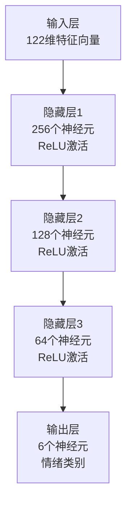

#### 2. CNN (卷积神经网络)模型

CNN模型结构如下：

- **输入层**：Mel频谱图 (128×94)
- **卷积块1**：32个3×3卷积核，BatchNorm，ReLU，2×2最大池化
- **卷积块2**：64个3×3卷积核，BatchNorm，ReLU，2×2最大池化
- **卷积块3**：128个3×3卷积核，BatchNorm，ReLU，2×2最大池化
- **卷积块4**：256个3×3卷积核，BatchNorm，ReLU，全局平均池化
- **全连接层**：128个神经元，ReLU
- **输出层**：6个神经元（对应6种情绪类别）

**CNN模型架构图**：

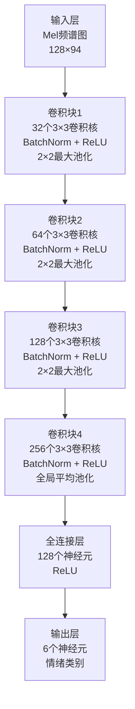

#### 3. ResNet (残差网络)模型

ResNet模型结构如下：

- **输入层**：Mel频谱图 (128×94)
- **初始卷积层**：32个3×3卷积核，BatchNorm，ReLU，2×2最大池化
- **残差层1**：2个残差块，输出通道64
- **残差层2**：2个残差块，输出通道128
- **残差层3**：2个残差块，输出通道256
- **全局平均池化**
- **全连接层**：128个神经元，ReLU
- **输出层**：6个神经元（对应6种情绪类别）

**ResNet模型架构图**：

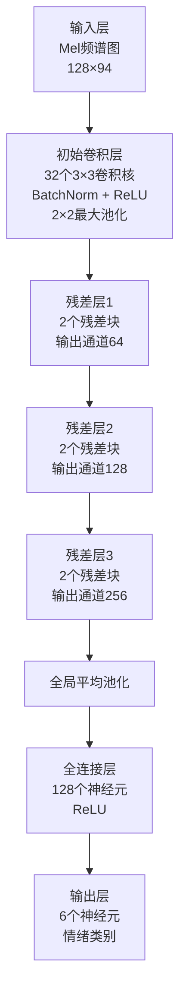

**残差块结构**：

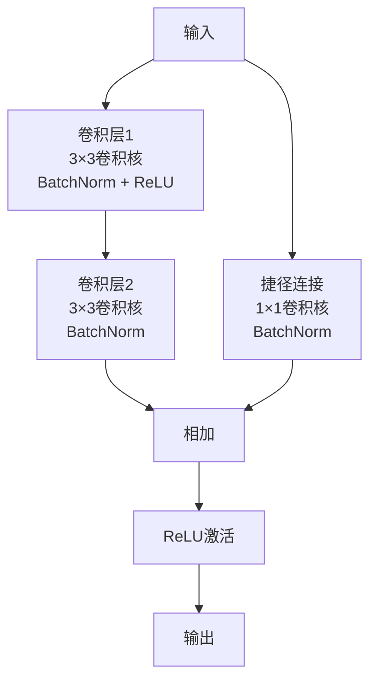

**CNN模型架构图**：

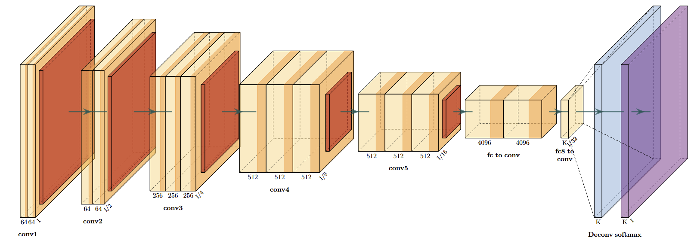

#### 4. 传统机器学习模型

- **SVM (支持向量机)**：使用RBF核函数，通过寻找最优超平面来分类情绪
- **Random Forest (随机森林)**：由多个决策树组成的集成学习模型，通过投票机制提高分类准确率

### 模型训练

- **损失函数**：交叉熵损失函数
  $$ Loss = -\sum_{i=1}^{N} \sum_{c=1}^{C} y_{i,c} \log(\hat{y}_{i,c}) $$
  其中，$y_{i,c}$是真实标签的one-hot编码，$\hat{y}_{i,c}$是模型预测的概率。

- **优化器**：Adam优化器，学习率为0.001

- **训练策略**：使用早停法防止过拟合，当验证集损失连续10个epoch没有改善时停止训练

### 情绪识别流程

1. **音频录制**：使用麦克风录制3秒音频
2. **特征提取**：从音频中提取122维特征向量
3. **模型推理**：将特征向量输入到选定的模型中进行推理
4. **结果输出**：计算各情绪类别的概率，输出识别结果

对于连续识别模式，系统会不断重复上述流程，并使用移动平均平滑预测结果：
$$ P_t = \alpha P_t + (1-\alpha) P_{t-1} $$
其中，$\alpha=0.7$是新数据的权重，$P_t$是当前预测概率，$P_{t-1}$是上一轮的预测概率。

### 模型评估
我们对三种模型进行了详细的评估，以下是部分结果：

**模型性能比较**
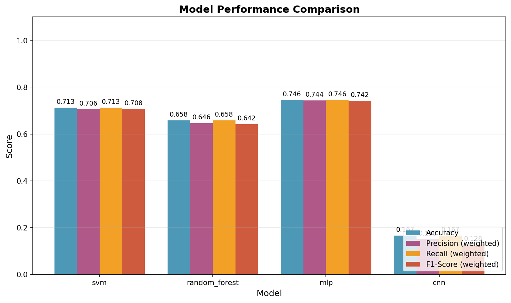

**MLP模型训练历史**
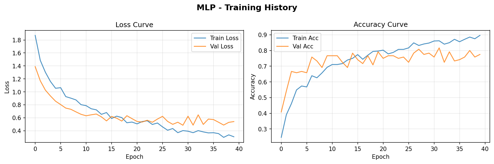

**各模型混淆矩阵**
- MLP模型
  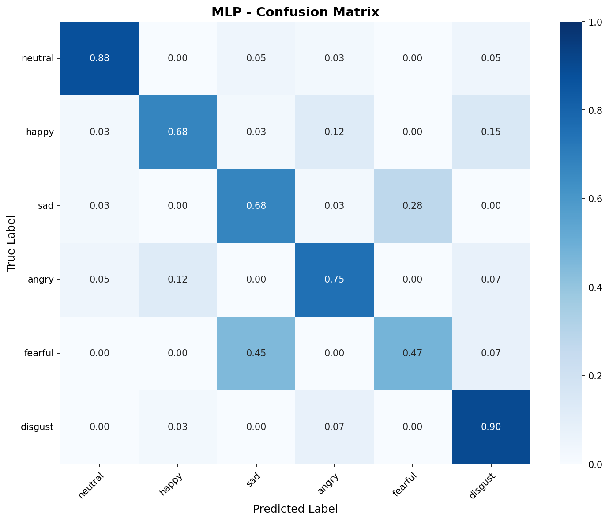
- CNN模型
  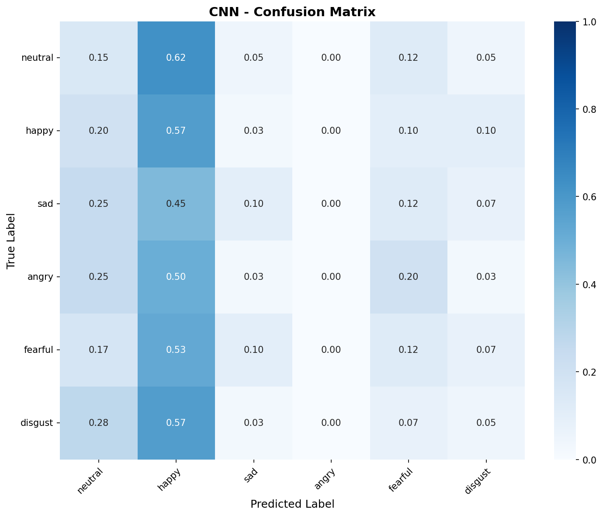
- Random Forest模型
  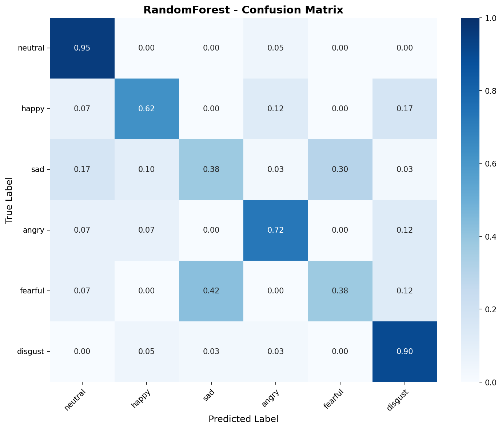
- SVM模型
  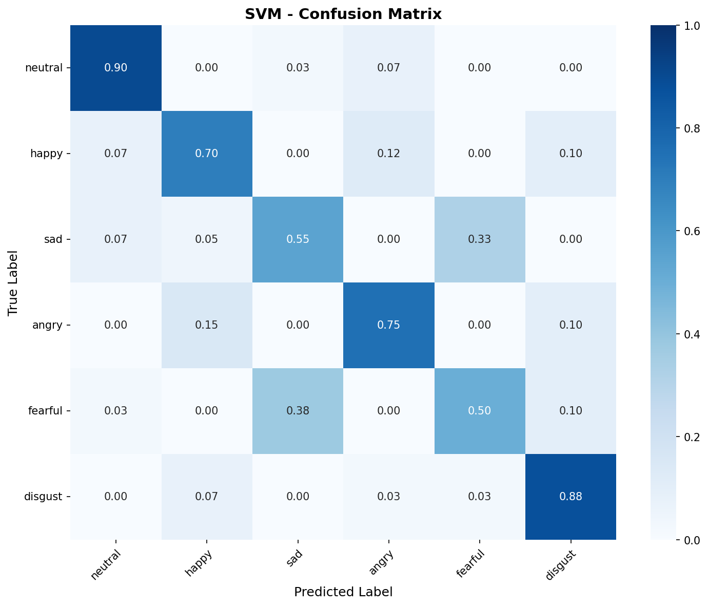

**各模型分类报告**
- MLP模型
  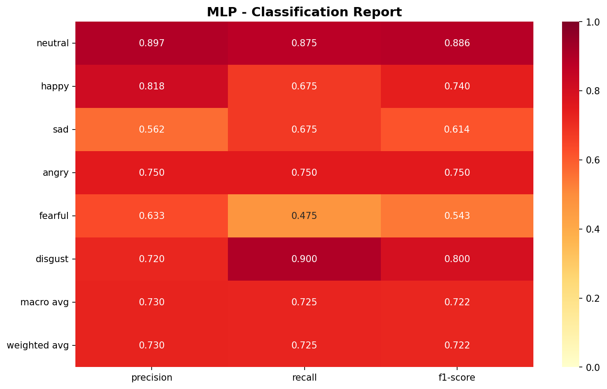
- CNN模型
  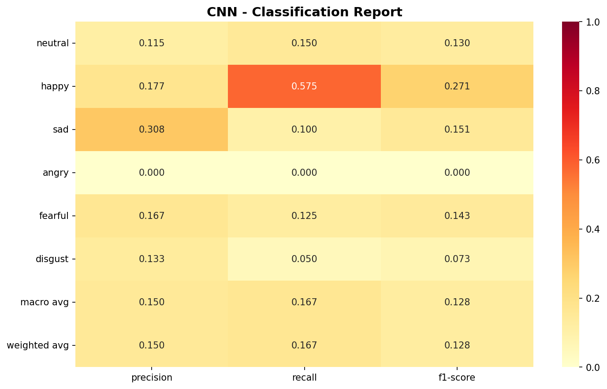
- Random Forest模型
  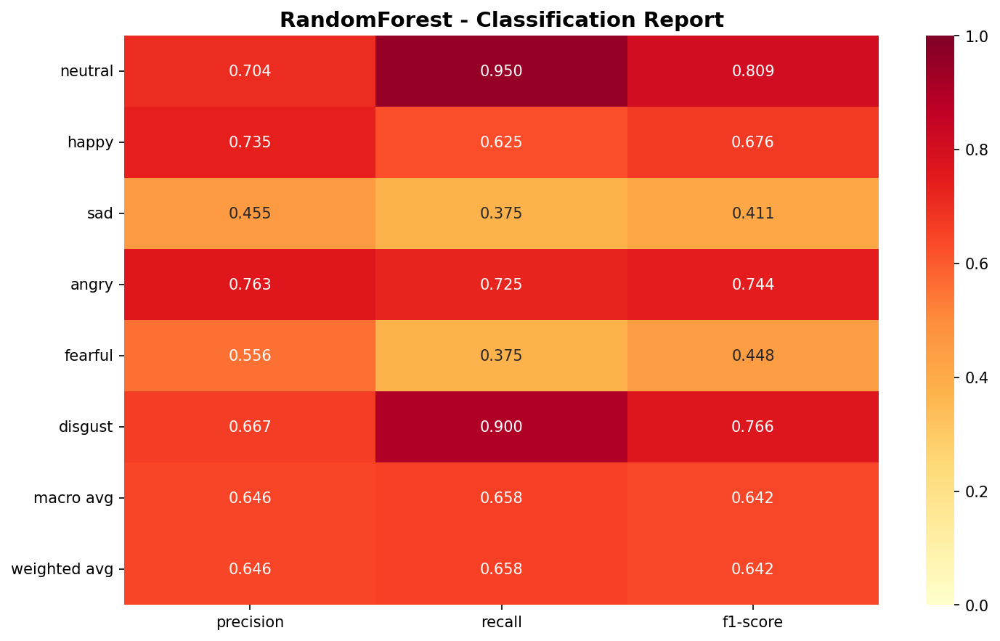
- SVM模型
  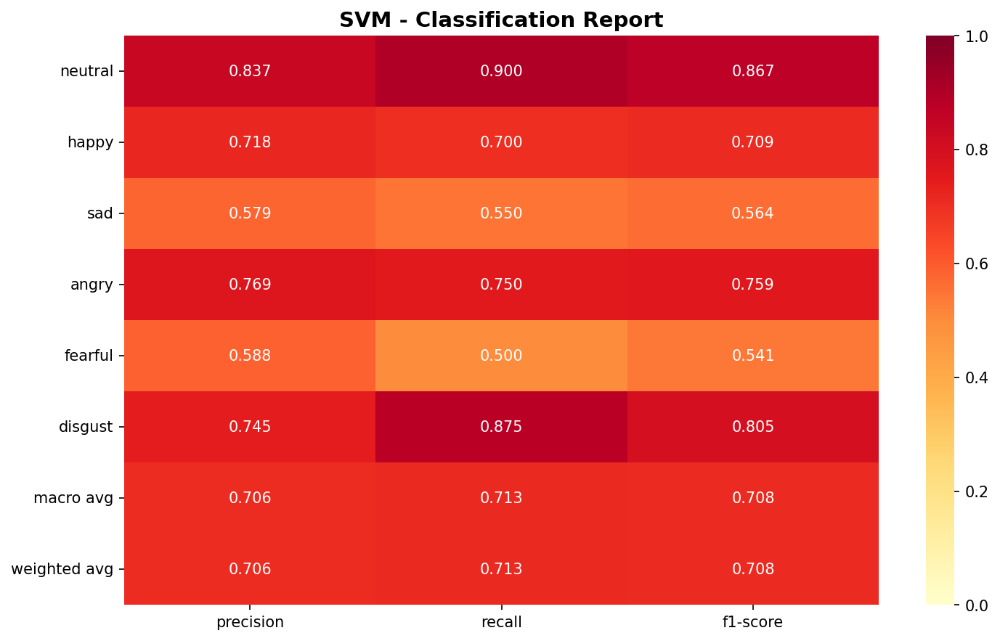

## 项目结构

```
yuyinshibei/
├── scripts/
│   └── real_time_recognition.py  # 实时识别脚本
├── speech_emotion_recognition/
│   ├── features/                # 特征提取模块
│   ├── models/                  # 模型定义
│   └── utils/                   # 工具函数
├── results/                     # 模型评估结果图像
└── .venv/                       # 虚拟环境
```

## 使用方法

### 安装依赖
```bash
pip install sounddevice soundfile torch scikit-learn joblib numpy
```

### 运行命令
```bash
# 单次识别（默认使用MLP模型）
python scripts/real_time_recognition.py

# 连续识别（使用SVM模型）
python scripts/real_time_recognition.py --model svm --mode continuous

# 查看可用音频设备
python scripts/real_time_recognition.py --list-devices
```

### 命令行参数
- `--model`：选择模型类型，可选值为 `svm`、`rf`（Random Forest）、`mlp`（默认）
- `--mode`：识别模式，可选值为 `single`（单次，默认）、`continuous`（连续）
- `--list-devices`：列出可用的音频输入设备
- `--device`：指定音频输入设备ID
- `--interval`：连续模式下的识别间隔（秒）

## 情绪类别

系统识别的六种情绪类别：

| 情绪 | 标签 | 表情符号 |
|------|------|----------|
| 中性 | neutral | 😐 |
| 快乐 | happy | 😊 |
| 悲伤 | sad | 😢 |
| 愤怒 | angry | 😠 |
| 恐惧 | fearful | 😨 |
| 惊讶 | surprised | 😲 |

## 应用场景

1. **情感监测**：实时了解自己或他人的情绪状态
2. **心理辅导**：辅助心理专业人士评估来访者情绪
3. **游戏开发**：根据玩家情绪调整游戏体验
4. **客服系统**：监测客服与客户的情绪互动
5. **教育领域**：了解学生在学习过程中的情绪变化

## 未来展望

- **模型优化**：进一步提高识别准确率和速度
- **多语言支持**：扩展到不同语言的语音情绪识别
- **实时可视化**：开发更直观的情绪变化可视化界面
- **边缘设备部署**：优化模型以支持在手机等边缘设备上运行
- **多模态融合**：结合面部表情、语音和文本等信息进行更全面的情绪识别

## 结语

语音情绪识别技术为我们打开了一扇了解人类情感的新窗口。通过这个项目，我们不仅实现了实时情绪识别的功能，也为情感计算领域的发展贡献了一份力量。未来，随着技术的不断进步，语音情绪识别将在更多领域发挥重要作用，让我们的生活更加智能化、个性化。

---

如果你对这个项目感兴趣，欢迎尝试运行代码并体验实时语音情绪识别的魅力！
